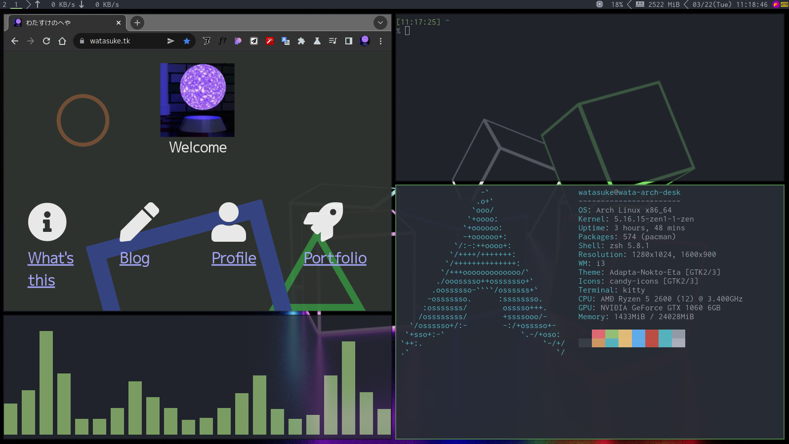

# dotfiles



## How to setup

```bash
git clone https://github.com/watasuke102/dotfiles
cd dotfiles
bash setup.sh
```

if you want to use full of this environment, install this packages with AUR helper on Arch Linux:

```
alacritty tmux bat dex dunst exa flameshot i3-wm i3lock-color neovim nitrogen picom polybar rofi rofi-greenclip ttf-myricam zsh
```

### notice

This script will be override existing files. Take backups if you needed.

## require

- curl
- git

## configuration list

- zsh: shell
- rofi: launcher
- tmux: multiplexer
- dunst: notification
- neovim: editor
- polybar: status bar
- i3-gaps: window manager
- alacritty: terminal

## License

[MIT-SUSHI WARE LICENSE](https://github.com/watasuke102/mit-sushi-ware)
