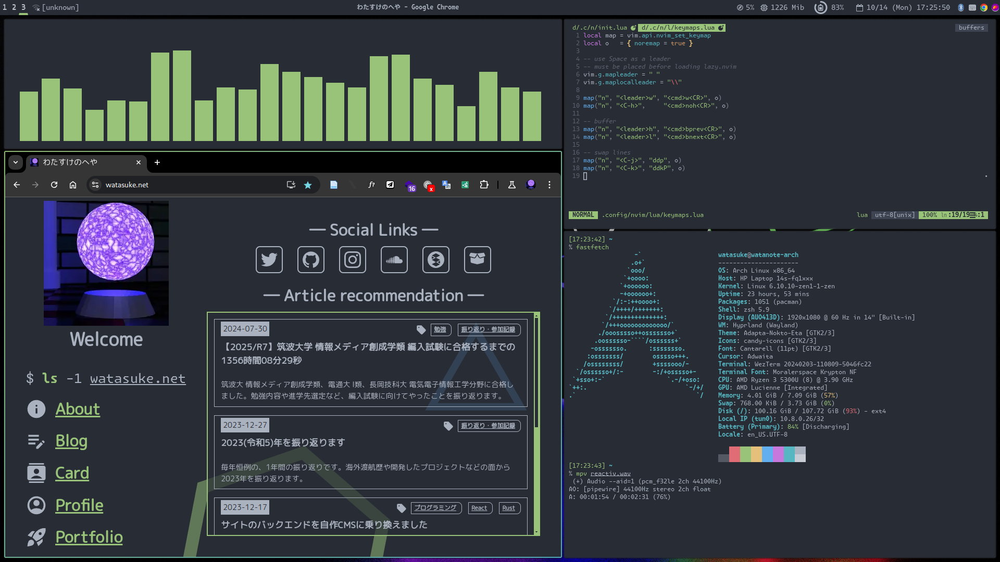

# dotfiles



## How to setup

require: `git`, `curl`

```bash
git clone https://github.com/watasuke102/dotfiles
cd dotfiles
bash setup.sh
```

### notice

This script will override existing files. Take backups if you need it.

## package dependency

If you want to use full environment, install these packages with AUR helper on Arch Linux:

### Hyprland

```
alsa-utils brightnessctl cliphist dex dunst flameshot hyprland hyprpaper swaylock-effects wezterm wl-clipboard wofi xdg-desktop-portal-hyprland
```

### ags

```
aylurs-gtk-shell libadwaita inotify-tools
```

### other

```
bat eza fzf lazygit neovim tmux xremap-x11-bin zsh
```

## configuration list

- zsh: shell
- gdb: debugger
- wofi: launcher
- tmux: multiplexer
- dunst: notification
- neovim: editor
- xremap: key mapper
- AGS: status bar
- Hyprland: window manager
- Wezterm: terminal

## License

[MIT-SUSHI WARE LICENSE](https://github.com/watasuke102/mit-sushi-ware)

